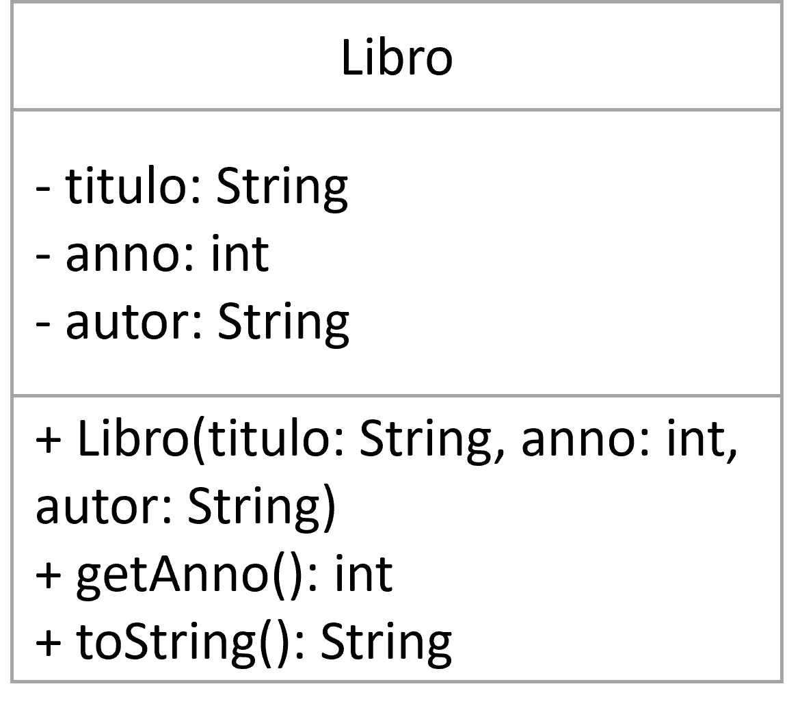

# Ejercicio 1 Listas

Dado el diagrama UML de la clase Libro, cree un programa que guarde libros (pida los datos por consola) hasta que la entrada del titulo sea "0". Luego de terminar la ingesta, pida un anno y realice la busqueda sobre la lista de libros.

